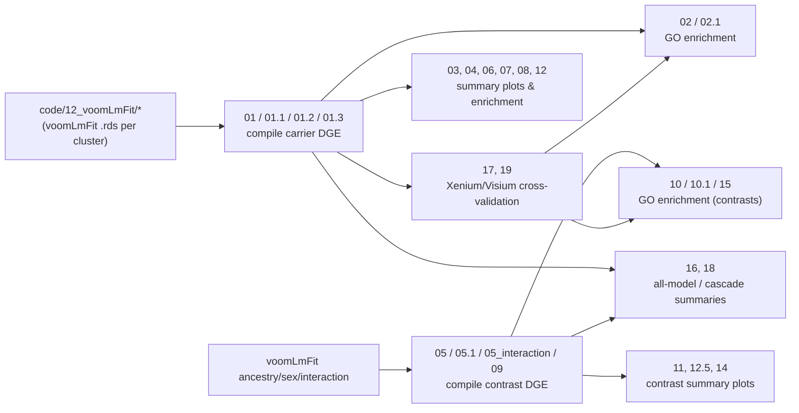

# Compile and Summarize Differential Gene Expression (DGE) Results

Scripts here compile `voomLmFit` output (from [`code/12_voomLmFit/`](../12_voomLmFit/)) across data types — `sn_broad`, `sn_fine`, `Visium`, and Xenium (`Xenium_cell_type_anno`, `Xenium_SpX`/`xSpD`, `Xenium_Oligo.3_Astro`) — into unified tables, then run GO enrichment, cross-platform validation, and produce summary figures (volcano plots, UpSet plots, heatmaps, boxplots) for the main APOE-carrier contrast plus ancestry, sex, and interaction contrasts. Most scripts take a `--datatype` (and sometimes `--contrast`/`--interaction`) command-line argument via `getopt`; matching `.sh` SLURM wrappers exist for most steps. `.R` files with no leading number (e.g. `logFC_heatmap.R`) are **sourced helper functions**, not standalone pipeline steps.

## Compile DGE tables (per data type)

* `01_compile_DGE` Compile the APOE-**carrier** `voomLmFit` results for `sn_broad`/`Visium` (`--datatype`) into a single tidy table, plot summary bar charts + volcano plots + t-stat/logFC `ggpairs` correlation plots. Saves `DGE_results_carrier_{datatype}.Rds/.csv`.
* `01.1_compile_DGE_sn_fine` Same as above, hardcoded to `sn_fine` (fine cell-type annotation).
* `01.2_compile_DGE_Xenium` Compile Xenium carrier DGE (`--datatype`, e.g. `Xenium_cell_type_anno`), then validate against the `sn_fine` results (`DGE_results_carrier_{datatype}_wSN.Rds`).
* `01.3_compile_DGE_Xenium_SpX` Same as `01.2` but for Xenium spatial-domain (`xSpD`/SpX) DGE, with additional cell-type-proportion/neighbor-context validation plots.
* `05_compile_DGE_ancestry` Compile the **ancestry** (EA vs. AA) contrast DGE per data type (`--datatype`).
* `05_compile_DGE_interaction` Compile **interaction** DGE (e.g. Age×carrier, Ancestry×carrier; `--datatype`, `--interaction`).
* `05.1_compile_DEG_ancestry_Xenium` Compile Xenium ancestry DGE and validate against `sn_fine` ancestry results.
* `09_compile_DGE_Sex` Compile the **sex** (carrier×sex interaction) contrast DGE per data type (`--datatype`).

## GO enrichment

* `02_GO_analysis` Run GO enrichment (`clusterProfiler`) on the main carrier DGE tables (`--datatype`).
* `02.1_GO_analysis_validate` GO enrichment restricted to Oligo.3 DEGs that validate in ≥1 Xenium context, using `sn_fine` as the background universe.
* `10_GO_analysis_contrast` GO enrichment for the ancestry/sex contrasts (`--datatype`, `--contrast`).
* `10.1_GO_analysis_Ancestry_refine` Refines the ancestry GO results to genes validated in Xenium.
* `15_GO_analysis_interaction` GO enrichment for interaction models (`--datatype`, `--interaction`).

## Cross-platform validation

* `17_validate_SpD_DEGs` Cross-validate Visium spatial-domain (SpD) DEGs against Xenium spatial (SpX) DEGs via an SpX→SpD lookup.
* `19_validate_summary` Summarizes cross-platform validation of carrier DEGs across all three Xenium contexts (`cell_type_anno`, `SpX`, `Oligo.3_Astro`) into `DGE_Xenium_validated_All.csv`, used by several later scripts (`02.1`, `10.1`).
* `13_DE_vs_Blanchard` Cross-validates `sn_fine` Oligo.3 DEGs against the external Blanchard et al. 2022 oligodendrocyte dataset.

## Summary plots and comparisons

* `03_DEG_Upset` UpSet plots comparing DEG overlap across `sn_broad`/`sn_fine`/`Visium`.
* `04_DEG_boxplots` Boxplots of individual gene expression (from pseudobulk data) per cluster, to sanity-check/visualize DGE hits (`--datatype`).
* `06_Volcano_plots` Publication-style volcano plots from the compiled carrier + ancestry DGE tables (`--datatype`).
* `07_DEG_stat_correlation` Pairwise correlation of t-stats/logFC across data types (`sn_broad`/`sn_fine`/`Visium`).
* `08_summary_plots` Summary heatmaps/bar plots across data types and contrasts (`--datatype`); sources `logFC_heatmap.R` and `DE_gene_set_enrichment.R`.
* `11_summary_plots_contrast` Same as `08` but for the ancestry/sex contrasts (`--datatype`, `--contrast`).
* `12_DE_enrichment` Tests carrier DEGs for enrichment against external gene sets (Mathys 2019 AD, Grubman 2019 neuroinflammation) via `DE_gene_set_enrichment.R` (`--datatype`).
* `12.5_DE_enrichment_contrast` Same as `12` for the ancestry/sex contrasts (`--datatype`, `--contrast`).
* `14_interaction_plots` Heatmaps/boxplots summarizing the interaction DGE results (hardcoded to `sn_fine`).
* `16_all_mod_summary` Aggregates summary stats (n genes, n FDR<0.05) across *all* models/data types/contrasts into one table (`all_models_summary.csv`).
* `18_all_analysis_summary` Multi-resolution "cascade" t-stat heatmaps (Visium → sn_broad → sn_fine) highlighting anchor genes across resolutions.

## Sourced helper functions (not run directly)

* `compare_stats_scatter.R` `compare_contrast_stats()` — scatter plots comparing statistics (t-stat/logFC) between two models/platforms, with correlation annotation. Sourced by `11_summary_plots_contrast.R`, `13_DE_vs_Blanchard.R`.
* `DE_gene_set_enrichment.R` `DE_gene_set_enrichment()` — Fisher's exact test for external gene-set enrichment among up/down DEGs. Sourced by `08_summary_plots.R`, `12_DE_enrichment.R`, `12.5_DE_enrichment_contrast.R`.
* `GO_logFC_heatmap.R` Helpers (`go_lookup()`, `parent_term_lookup()`, `get_go_genes()`, `get_go_DE_stats()`) for GO-term-driven heatmaps. Sourced by `02_GO_analysis.R`, `10_GO_analysis_contrast.R`, `15_GO_analysis_interaction.R`.
* `logFC_heatmap.R` `logFC_Heatmap()` — core t-stat/logFC heatmap (with significance annotation, configurable fill statistic). Sourced by `08_summary_plots.R`, `11_summary_plots_contrast.R`, `14_interaction_plots.R`, `18_all_analysis_summary.R`.
* `SpX_tstat_heatmap.R` `SpX_tstat_heatmap()` — Xenium spatial-domain (SpX) × cell-type t-stat heatmap, colored by APOE-carrier direction.

## Data flow at a glance

## Outputs

Compiled tables and enrichment results are written to `processed-data/13_compile_DGE/<NN_script_name>/`; figures go to `plots/13_compile_DGE/<NN_script_name>/`, generally namespaced by `{datatype}` (and `{contrast}`/`{interaction}` where applicable).
